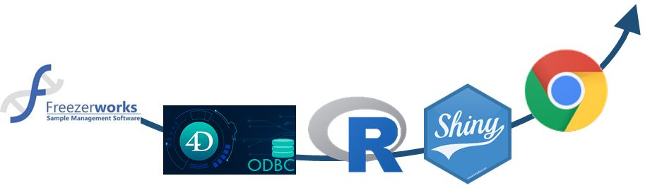

# FreezerVIS

FreezerVIS connects directly to the sample management database used in the NIST Biorepository. It enables high level visualization of the contents of a sample repository to address questions around asset management of freezer space utilization (e.g. how much has been used?) and allocation (e.g. how are samples distributed?).

This is accomplished through [R](https://www.r-project.org/) via the [Shiny](https://shiny.rstudio.com/) package and connects using an Open Database Connectivity (ODBC) driver. If you can connect to your database through R (or can create a scheduled data update via another language), you should be able to make any necessary modifications to use FreezrVIS in your repository.

For now, FreezerVIS only supports the Freezerworks Sample Management System* by [Dataworks Development Inc](https://freezerworks.com/). Any sample managment database available via ODBC should be amenable to inclusion provided a query can return Freezer Name, three position identifiers (e.g. Rack, Box, Position), and Container Type.

Feel free to fork FreezerVIS for your own use and make any modifications** or contact [Jared M. Ragland](mailto:jared.ragland@nist.gov?subject=FreezerVIS) for more information or to start a conversation.

###### * Any mention of commercial products within NIST web pages is for information only; it does not imply recommendation or endorsement by NIST.

###### ** NIST-developed software is provided by NIST as a public service. You may use, copy and distribute copies of the software in any medium, provided that you keep intact this entire notice. You may improve, modify and create derivative works of the software or any portion of the software, and you may copy and distribute such modifications or works. Modified works should carry a notice stating that you changed the software and should note the date and nature of any such change. Please explicitly acknowledge the National Institute of Standards and Technology as the source of the software. NIST-developed software is expressly provided "AS IS." NIST MAKES NO WARRANTY OF ANY KIND, EXPRESS, IMPLIED, IN FACT OR ARISING BY OPERATION OF LAW, INCLUDING, WITHOUT LIMITATION, THE IMPLIED WARRANTY OF MERCHANTABILITY, FITNESS FOR A PARTICULAR PURPOSE, NON-INFRINGEMENT AND DATA ACCURACY. NIST NEITHER REPRESENTS NOR WARRANTS THAT THE OPERATION OF THE SOFTWARE WILL BE UNINTERRUPTED OR ERROR-FREE, OR THAT ANY DEFECTS WILL BE CORRECTED. NIST DOES NOT WARRANT OR MAKE ANY REPRESENTATIONS REGARDING THE USE OF THE SOFTWARE OR THE RESULTS THEREOF, INCLUDING BUT NOT LIMITED TO THE CORRECTNESS, ACCURACY, RELIABILITY, OR USEFULNESS OF THE SOFTWARE. You are solely responsible for determining the appropriateness of using and distributing the software and you assume all risks associated with its use, including but not limited to the risks and costs of program errors, compliance with applicable laws, damage to or loss of data, programs or equipment, and the unavailability or interruption of operation. This software is not intended to be used in any situation where a failure could cause risk of injury or damage to property. The software developed by NIST employees is not subject to copyright protection within the United States.
